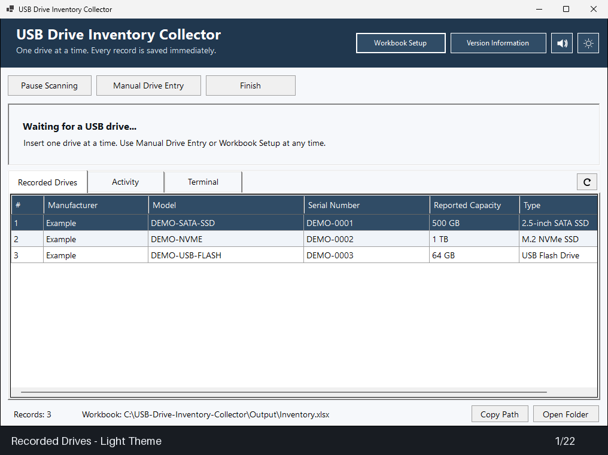

# USB Drive Inventory Collector

> **AI Workflow Notice:** This project was written through AI prompting and reviewed by its maintainer. Check collected data against the drive label when accuracy matters.

## Table of Contents

- [Features](#features)
- [Showcase](#showcase)
- [Download and Run](#download-and-run)
- [Interfaces](#interfaces)
  - [Graphical Interface](#graphical-interface)
  - [Terminal Interface](#terminal-interface)
  - [Terminal Keys](#terminal-keys)
  - [Settings and Values](#settings-and-values)
- [Drive Identification](#drive-identification)
- [Files and Workbook](#files-and-workbook)
- [Build from Source](#build-from-source)
- [License](#license)
- [Attributions](#attributions)

## Features

- Scans USB-connected physical drives and excludes Windows boot and system disks.
- Reads drive identity through smartmontools, with USB transport fallbacks for common adapters.
- Saves each drive to an XLSX workbook as soon as it is recorded. Excel is not required.
- Provides manual entry with input checks, review, duplicate-serial detection, and `N/A` for skipped values.
- Lets you copy the last saved drive when entering a batch that shares the same information.
- Supports optional identity columns and a configurable workbook location.
- Includes both graphical and terminal interfaces in the same executable.
- Offers to disable AutoPlay for the session and restores its previous setting when the collector exits normally.
- Shows recorded drives and activity, and lets you edit a saved row by double-clicking it.
- Lets you remove a saved entry from the double-click dialog after confirming the removal.
- Displays a record number in the app without adding a column to the workbook.
- Restores the Recorded Drives layout with Reset View without changing workbook data.
- Uses distinct reading, error, and saved-record status colors in the graphical interface.

## Showcase

The preview cycles through the app's tabs and dialogs every six seconds. Captures use the default opening sizes and fictional sample records. Smaller windows are centered in the animation without scaling. The Terminal capture shows the tab before its session is enabled.



<details>
<summary>View individual PNG screenshots in either theme</summary>

| Function | Dark theme | Light theme |
| --- | --- | --- |
| Recorded Drives | [PNG](.github/showcase/showcase_recorded_drives.png) | [PNG](.github/showcase/showcase_recorded_drives2.png) |
| Manual Drive Entry | [PNG](.github/showcase/showcase_manual_entry.png) | [PNG](.github/showcase/showcase_manual_entry2.png) |
| Review entry | [PNG](.github/showcase/showcase_review_entry.png) | [PNG](.github/showcase/showcase_review_entry2.png) |
| Duplicate serial warning | [PNG](.github/showcase/showcase_duplicate_serial.png) | [PNG](.github/showcase/showcase_duplicate_serial2.png) |
| Edit entry and Remove Entry option | [PNG](.github/showcase/showcase_edit_entry.png) | [PNG](.github/showcase/showcase_edit_entry2.png) |
| Removal confirmation | [PNG](.github/showcase/showcase_remove_entry.png) | [PNG](.github/showcase/showcase_remove_entry2.png) |
| Workbook Setup | [PNG](.github/showcase/showcase_workbook_setup.png) | [PNG](.github/showcase/showcase_workbook_setup2.png) |
| Activity history | [PNG](.github/showcase/showcase_activity.png) | [PNG](.github/showcase/showcase_activity2.png) |
| Terminal tab | [PNG](.github/showcase/showcase_terminal.png) | [PNG](.github/showcase/showcase_terminal2.png) |
| Paused scanning | [PNG](.github/showcase/showcase_paused_scanning.png) | [PNG](.github/showcase/showcase_paused_scanning2.png) |
| Version Information | [PNG](.github/showcase/showcase_version_info.png) | [PNG](.github/showcase/showcase_version_info2.png) |

</details>

The [capture instructions](.github/showcase/README.md) explain how to refresh the screenshots and GIF.

## Download and Run

The next tagged version is **4.3.5**. Signed Windows x64 builds are published on the [GitHub Releases page](https://github.com/ShannonWetnight/usb-drive-inventory-collector/releases). The build produces `USB-Drive-Inventory-Collector-v4.3.5.exe`. Download the release asset, double-click it, and approve the administrator prompt. No PowerShell execution-policy change is required.

Automatic drive identification requires `smartctl.exe` from smartmontools. If it is missing, the graphical app offers to install smartmontools through WinGet. In Terminal, automatic scanning remains unavailable if smartmontools is missing; manual entry is still available.

Connect one drive at a time and wait for the result before removing it. Keep the workbook closed in spreadsheet software while collecting so the app can save it after each drive.

## Interfaces

The executable opens the graphical interface by default. Select the **Terminal** tab, then choose **Enable Terminal** beside the tab to start the terminal workflow. The toggle reads **Disable Terminal** while active and remains available when switching tabs. GUI scanning pauses while Terminal runs; after Terminal closes, the workbook reloads and GUI scanning resumes unless scanning was paused. The **Pause Scanning** control and Terminal `[P]` command share the same pause state.

### Graphical Interface

The main window includes **Recorded Drives**, **Activity**, and **Terminal** tabs.

| Control | Action |
| --- | --- |
| **Pause Scanning** | Stops automatic drive checks until you resume scanning. |
| **Manual Drive Entry** | Opens the form to enter and review a drive record. |
| **Workbook Setup** | Selects optional identity columns, the workbook save location, and the logs save folder. |
| **Terminal** tab | Shows the embedded terminal panel, initially disabled. |
| **Enable Terminal / Disable Terminal** | Starts or stops the embedded terminal. Appears beside the tab when selected and remains visible while Terminal is running. |
| **Version Information** | Opens the app version, license, technical details, and attributions with project links from the banner. |
| Sound icon | Turns drive notification sounds on or off. The choice is saved for this Windows account. |
| Theme icon beside Sound | Switches directly between **Light** and **Dark**. The app follows the Windows app theme by default until you toggle it; your chosen mode is saved for this Windows account. |
| **Copy Path** | Copies the active workbook path to the clipboard. |
| **Open Folder** | Opens the workbook's containing folder in File Explorer. |
| **Reset View** | Appears when the Recorded Drives view changes. Restores default grid widths, row heights, sort order, and scroll position without changing the workbook. |
| Refresh icon | Reloads the active workbook from disk and updates Recorded Drives. |
| **Finish** | Shows the saved workbook path with Copy Path, Open Folder, and Close controls. |
| Double-click a recorded row | Opens that saved record for editing or removal, including after sorting. **Remove Entry** asks for confirmation before deleting the row from the workbook. |

Drive types can be searched in the manual-entry list. Choose **Other** to enter a custom type. **Copy Last Drive** is available inside Manual Drive Entry.

To remove a record, double-click it in **Recorded Drives**, select **Remove Entry**, and confirm the model and serial number. The confirmation defaults to **No**. Removal discards any unsaved edits in the dialog, updates the workbook immediately, and renumbers the remaining records. If saving fails, the entry stays in the app. Disable Terminal and wait for any current drive read to finish before editing or removing entries.

The theme applies to the main window and the collector's custom dialogs. The default **System** preference follows Windows theme changes while the app is open. Clicking the theme icon switches to the opposite mode and saves that choice. Native Windows prompts and file pickers use Windows styling; the embedded Terminal keeps its console colors.

### Terminal Interface

Select the **Terminal** tab, then **Enable Terminal** to start the console-style workflow. Press a command key while scanning. For prompts, type a response in the input box and press Enter or select **Send**. Prompts, manual entry, workbook setup, and scan results appear in the output area. Select **Disable Terminal** to return to GUI scanning.

The same executable can also open a separate console window when started with `--terminal`:

```powershell
& '.\USB-Drive-Inventory-Collector-v4.3.5.exe' --terminal
```

### Terminal Keys

| Key | Action |
| --- | --- |
| `[M]` | Start Manual Drive Entry. |
| `[L]` | Copy the last saved drive and enter a new serial number. |
| `[S]` | Open Workbook Setup. |
| `[R]` | List recorded entries and remove one after confirmation. |
| `[P]` | Pause or resume scanning. |
| `[D]` | Show Version Information. |
| `[H]` | Show the usage summary. |
| `[Q]` | Finish and close the collector. |
| `[Enter]` | Submit the current answer. |

To remove a record in Terminal, press **[R]**, choose its displayed record number, and check the model and serial number in the confirmation. Enter **Y** to remove it; any other response cancels. At the record-selection prompt, press Enter or type `:cancel` to return. Successful removal is saved and logged with the workbook row, model, and serial number. This command works in both embedded Terminal and the separate `--terminal` window. Recorded Drives reloads when embedded Terminal closes.

### Settings and Values

| Setting or value | Behavior |
| --- | --- |
| Workbook save location | Defaults to `Output/Inventory.xlsx` beside the executable. The selected path is remembered for the current Windows account. |
| Logs save location | Defaults to `Output/Logs/` beside the executable. Choose another folder in Workbook Setup; it is remembered for the current Windows account. |
| Workbook columns | Manufacturer, Model, Serial Number, Reported Capacity, and Type are included by default. Workbook Setup can add supported identity fields. |
| AutoPlay | If enabled, the app asks whether to disable it for the session. The previous setting is restored on normal exit. |
| Manual fields | Blank values are saved as `N/A`. Model and serial values are converted to uppercase. |
| Capacity | Enter a numeric value and select a unit: B, KB, MB, GB, TB, PB, or a custom unit. |
| Drive type | Select a listed type or choose Other and enter a custom value. |
| Duplicate serial | A record with a serial number already in the workbook cannot be saved again. |
| Drive read timeout | Each smartctl process has a 30-second timeout. |

## Drive Identification

The collector uses smartctl autodetection and USB transport fallbacks for supported USB adapters. Some bridges report their own identity or hide information about the drive behind them. When a read times out, check the adapter and reconnect it before trying again. The collector does not reset a USB controller.

## Files and Workbook

The default workbook is saved in `Output/Inventory.xlsx` beside the executable. Session logs default to `Output/Logs/`. Workbook Setup lets you choose both locations and remembers them for the current Windows account. Changing the logs folder moves the active GUI log there. The workbook uses the XLSX format and is written directly without Excel COM automation.

## Build from Source

Build on Windows with the .NET 8 SDK:

```powershell
dotnet publish WindowsApp/USBDriveInventoryCollector.csproj --configuration Release --runtime win-x64 --self-contained true -p:PublishSingleFile=true -p:IncludeNativeLibrariesForSelfExtract=true --output publish
```

The [Build Windows GUI](.github/workflows/build-native.yml) workflow builds pull requests and uploads an unsigned preview executable. The [Publish Signed Release](.github/workflows/release.yml) workflow checks the version and release notes, signs the executable through Azure Artifact Signing, verifies its publisher, and attaches the executable, SHA-256 checksum, and `LICENSE` to a GitHub release. The combined `LICENSE` contains the collector's MIT license followed by dependency attributions and upstream license notices. It is also included in preview downloads.

## License

[MIT License](LICENSE). Copyright (c) 2026 Shannon Wetnight. Distributed copies must retain the copyright and license notice. The software is provided without warranty.

The MIT license was adopted after v4.3.3. Code previously released under the Unlicense retains its public-domain dedication; this change does not revoke those permissions. MIT's notice requirement applies to new copyrightable contributions covered by the MIT license.

## Attributions

The collector depends on work by these projects and their contributors:

| Project | Contribution | Attribution and license |
| --- | --- | --- |
| [Open XML SDK](https://github.com/dotnet/Open-XML-SDK) | Creates and validates XLSX workbooks through `DocumentFormat.OpenXml` and `DocumentFormat.OpenXml.Framework` 3.3.0. | .NET Foundation and Contributors; [MIT](https://github.com/dotnet/Open-XML-SDK/blob/v3.3.0/LICENSE). |
| [.NET runtime and libraries](https://github.com/dotnet/runtime) | Provides the .NET 8 runtime, WMI access through `System.Management`, code-page support through `System.Text.Encoding.CodePages`, workbook packaging through `System.IO.Packaging`, and its `System.CodeDom` dependency. | .NET Foundation and Contributors; [MIT source license](https://github.com/dotnet/runtime/blob/v8.0.31/LICENSE.TXT), component notices, and [Windows binary terms](https://github.com/dotnet/core/blob/main/license-information-windows.md). |
| [Windows Forms](https://github.com/dotnet/winforms) | Provides the desktop interface. | .NET Foundation and Contributors; [MIT](https://github.com/dotnet/winforms/blob/v8.0.31/LICENSE.TXT), with additional upstream notices. |
| [Windows Presentation Foundation (WPF)](https://github.com/dotnet/wpf) | Bundled by the self-contained Windows Desktop runtime. | .NET Foundation and Contributors; [MIT source license](https://github.com/dotnet/wpf/blob/v8.0.31/LICENSE.TXT), component notices, and Windows binary terms. |
| [smartmontools / smartctl](https://www.smartmontools.org/) | Reads drive identity and SMART information for automatic scanning. | smartmontools developers; [GPL-2.0-or-later source](https://github.com/smartmontools/smartmontools). Installed separately and invoked as an external program. |

License text, applicable component notices, and links to Microsoft Windows binary terms appear under **Attributions:** in [LICENSE](LICENSE), after the collector's MIT license. Keep this combined file with distributed copies. The [license audit](docs/license-audit.md) records the published dependencies and excluded build, test, and platform notices. Project links also appear at the bottom of **Version Information**.

The self-contained Windows release bundles .NET and Windows Desktop libraries, including WPF binaries even though the collector uses Windows Forms. Their component notices apply to the distributed executable. The collector's own source code is MIT-licensed; Microsoft's .NET Library and Windows SDK licenses apply to the Windows binaries identified in LICENSE.
